<picture>
  <source media="(prefers-color-scheme: dark)" srcset="./assets/capsule-wave-header-dark-fast.svg" />
  <source media="(prefers-color-scheme: light)" srcset="./assets/capsule-wave-header-light-fast.svg" />
  
</picture>

  <a href="https://git.io/typing-svg">
    <!-- TODO: 补充更多轮播文本，在 lines= 参数中用分号分隔 -->
    
  </a>

  

## About

  <picture>
    <source media="(prefers-color-scheme: dark)" srcset="./assets/slogan-dark.svg" />
    <source media="(prefers-color-scheme: light)" srcset="./assets/slogan-light.svg" />
    
  </picture>

## Tech & Focus

  <picture></picture>&#8202;
  <picture></picture>&#8202;
  <picture></picture>&#8202;
  <picture></picture>&#8202;
  <picture></picture>
   
  <picture></picture>&#8202;
  <picture></picture>&#8202;
  <picture></picture>&#8202;
  <picture></picture>&#8202;
  <picture></picture>&#8202;
  <picture></picture>&#8202;
  <picture></picture>&#8202;
  <picture></picture>&#8202;
  <picture></picture>

## Members

<table align="center">
  <tr>
    <td align="center"><a href="https://github.com/kevinlasnh"> <b>kevinlasnh</b></a></td>
    <td align="center"><a href="https://github.com/Cryonix0408"> <b>Cryonix0408</b></a></td>
    <td align="center"><a href="https://github.com/FFraankk"> <b>FFraankk</b></a></td>
    <td align="center"><a href="https://github.com/jhlongbaba"> <b>jhlongbaba</b></a></td>
    <td align="center"><a href="https://github.com/youngman05"> <b>youngman05</b></a></td>
  </tr>
</table>

## Contact

&#8194;

<picture>
  <source media="(prefers-color-scheme: dark)" srcset="./assets/capsule-wave-footer-dark-fast.svg" />
  <source media="(prefers-color-scheme: light)" srcset="./assets/capsule-wave-footer-light-fast.svg" />
  
</picture>
